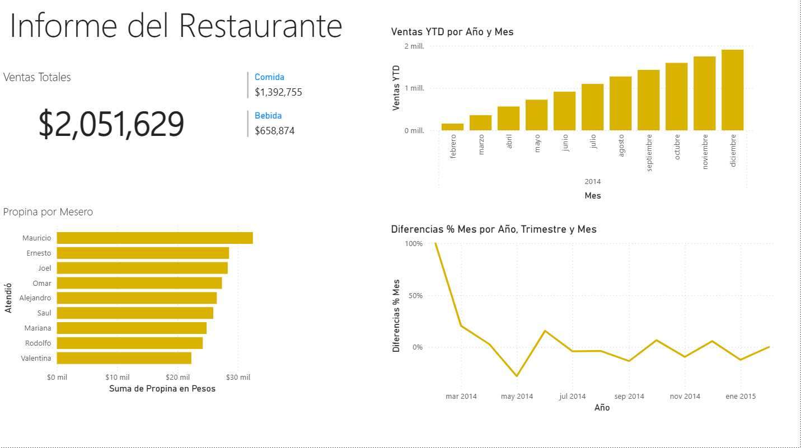
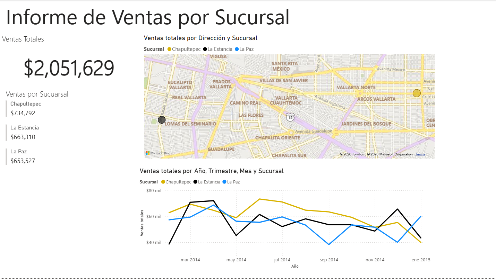
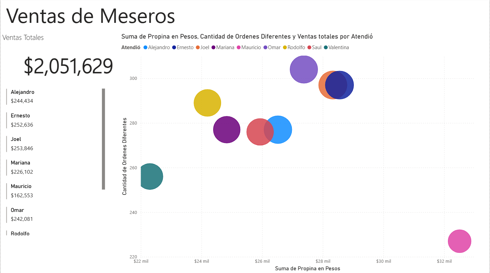
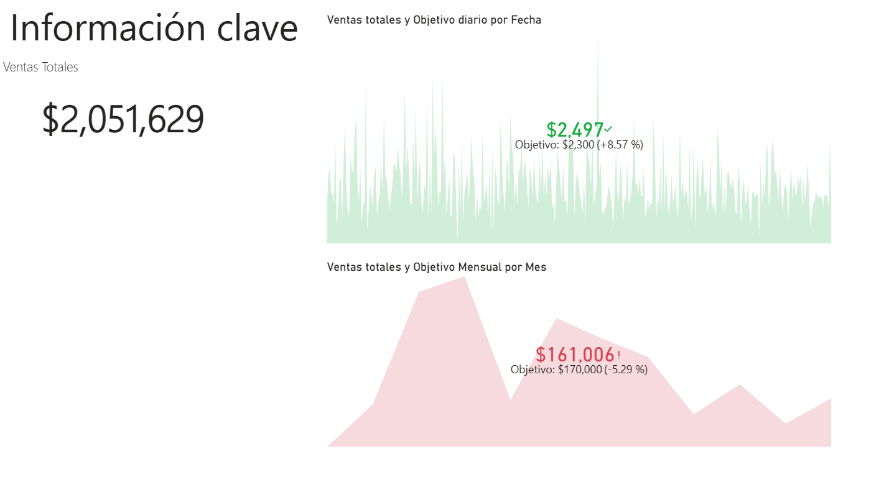
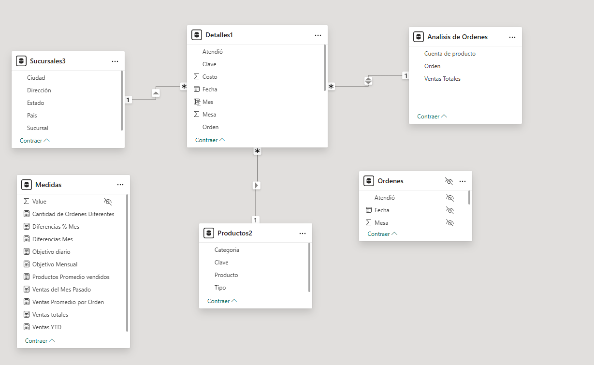

# 🍽 Restaurant Sales & Operations Analytics Dashboard

Interactive Power BI dashboard focused on restaurant sales performance, operational analytics, branch comparison, and employee performance monitoring through KPI tracking and time-based analysis.

---

## 📌 Project Overview

This project combines DAX calculations, operational reporting, and interactive visualizations to analyze sales behavior, branch performance, waiter activity, and order metrics across different business dimensions.

The dashboards support business-oriented analysis of operational KPIs, sales trends, performance tracking, and target achievement over time.

---

## 🛠 Tools & Technologies

- Power BI
- Power Query
- DAX
- Data Modeling
- KPI Development
- Operational Analytics
- Interactive Dashboard Design

---

## 📊 Analytical Questions Explored

- Why are restaurant sales decreasing over time?
- Which branches generate the strongest sales performance?
- Which waiters generate the highest sales and tips?
- How do sales evolve across months and branches?
- Are daily and monthly sales targets being achieved?
- Which operational metrics affect restaurant performance?

---

## 📈 Dashboard Features

- Executive restaurant KPI dashboard
- Sales YTD analysis
- Month-over-month percentage variation
- Branch sales comparison
- Waiter performance analysis
- Order behavior analysis
- Daily and monthly target tracking
- Time-based sales analysis
- Bidirectional filtering for operational analysis

---

## 🔍 Key Insight

The dashboards reveal a progressive decline in restaurant sales performance while identifying differences between branches, waiter productivity, operational metrics, and target achievement over time.

---

## 🖼 Dashboard Preview

### Restaurant Overview Dashboard

---

### Branch Performance Analysis

---

### Waiter Performance Analysis

---

### KPI & Operational Targets

---

## 🔄 Data Model

---

## 🎯 Key Skills Demonstrated

- DAX calculations
- Operational analytics
- KPI development
- Restaurant sales analysis
- Employee performance analysis
- Time intelligence calculations
- Context-aware DAX measures
- Bidirectional filtering implementation
- Interactive dashboard design
- Business intelligence reporting

---

## 🔗 Portfolio

- Notion Portfolio: https://www.notion.so/Restaurant-Sales-Operations-Analytics-Dashboard-360ddeb9784680eea834f8daf2159c8b?source=copy_link
